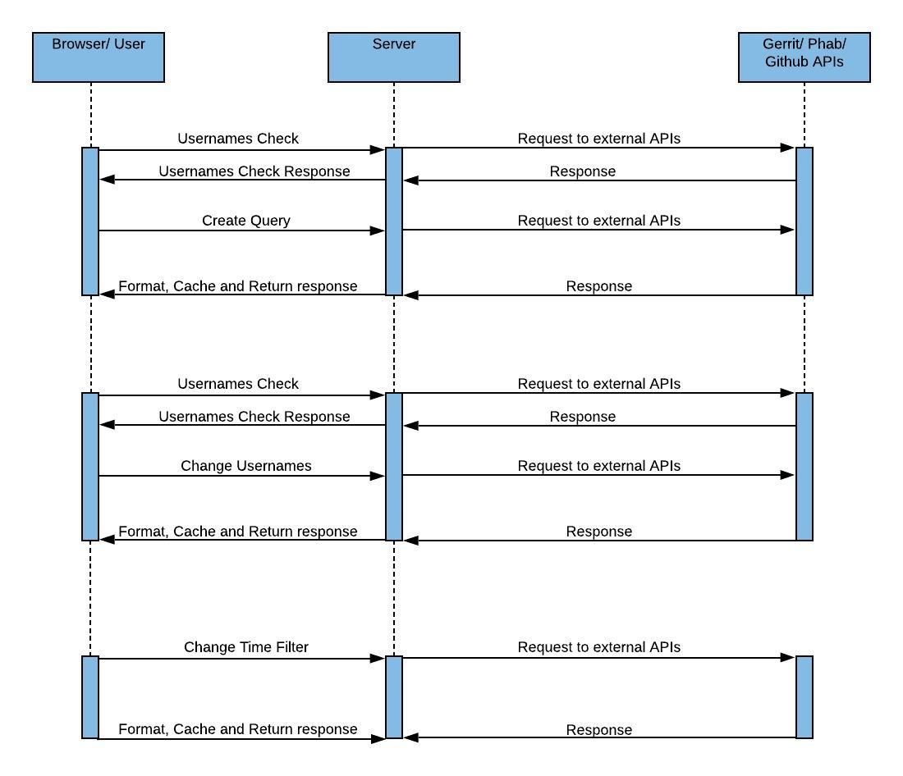

.. note::
   Please note that all functionalities associated with the features allowing users to add multiple contributors details at once has been disabled. If these features are
   important to you, you can reach out on `Github <https://github.com/wikimedia/wikicontrib>`_ or `WikiContrib talk page <https://meta.wikimedia.org/wiki/Talk:WikiContrib>`_

================
Internal Working
================


In the **Usage** section, we discussed the architecture and how to use the tool. Let's extend the discussion
with a complete note of how the tool works internally.

We shall start our discussion with the schema diagram of the tool's database.

.. image:: ./schema.jpeg

As you can see above, there are four tables:

1. Query.
2. Query users.
3. Query Filters.
4. List commits.

**Query** has the data regarding the ``hash``, ``created time`` etc. The usernames of the Wikimedians that the user provided during the query creation will be stored in **Query users** table. All the filters associated with the query will be stored in **Query Filters** table.

Whenever a user attempts to create or update a query (change the usernames), we first make sure that the usernames belong to the same user by calling ``matchFullNames`` view and returning a response that helps us decide whether to proceed or to first warn the user of the mismatch.
Let's dig deep into the working of ``matchFullNames`` view.

This view uses ``asyncio`` and ``aiohttp`` to perform API requests in a parallel manner. It formats the submitted usernames, creates an event loop, and passes the event loop to ``concurrent_get_fullnames`` where we create three co-routines for Phabricator, Gerrit, and Github and attempts fetching the contributors fullnames on these platforms through ``get_full_name``.
(If you are not familiar with event loops and co-routines, they are used to perform threading programmatically, you can get more information about them `here <https://docs.python.org/3/library/asyncio.html>`_).

.. code-block:: python
   async def concurrent_get_fullnames(urls, request_data, loop, full_names):
           tasks = []
           async with ClientSession() as session:
               tasks.append(loop.create_task((get_full_name(data = {"platform":"phab", "session":session,
                "full_names":full_names, "url":urls[0], "request_data":request_data[0]}))))
               tasks.append(loop.create_task((get_full_name(data = {"platform":"gerrit", "session":session,
                "full_names":full_names, "url":urls[1]}))))
               tasks.append(loop.create_task((get_full_name(data = {"platform":"github", "session":session,
                "full_names":full_names, "request_data":request_data[1]}))))
               await asyncio.gather(*tasks)

The above code adds three tasks to the event loop. Each of the tasks fetches the contributor's fullname on one of the three platforms.
These are parallel because, let's assume there are two tasks **task1** and **task2**, initially, the loop started executing **task1**. If **task1** performs any API request, it has to wait till the response is received to proceed further. So, whenever the **task1**
performs an API request, **asyncio** stores the state of **task1** and starts executing **task2**. When the response to the **task1** is received, it stores the current task and executes the **task1** further.
When we are done attempting to fetch the fullnames, the results are passed to ``fuzzyMatching`` which uses fuzzy matching to figure out the probability that the usernames belong to the same user. the result of this matching is then returned as HTTP response.

If the usernames belong to the same user or if the user ignores the warning when usernames don't belong to the same user, we then query the server. Initially, a class named ``AddQueryUser`` view is triggered. The view creates a Query with a hash that is based on the usernames submitted
and adds the provided usernames data to the query. This also creates a default set of filters and returns a redirect to ``/<hash>`` URL.

The URL triggers ``DisplayResult`` view. This view gets the necessary query data from the database and passes it on to ``getDetails`` where we decide whether to perform external API requests, fetch the details and cache the fetched data in the database or to return the already cached data
from the database depending on whether we have cached that particular query in the past and if the query is not more than a day old. It also formats the data and returns the data to the browser as an HTTP response.
Let's dig deep into the working of ``DisplayResult`` view.

This view also uses ``asyncio`` and ``aiohttp`` to perform API requests in a parallel manner. There are few constraints with the existing Phabricator, Gerrit, and Github APIs. Both Phabricator and Gerrit can not return the count of contributions made by a particular user. They will return the
contributions made by the user in the form of a list of JSON objects. The good thing about ``Gerrit`` is it returns contributions of all the users with a single API request. But in the case of phabricator and Github, they will paginate the results with a max of 100 contributions on each
page. For example, if a user performed 1000 different actions in phabricator or Github, then 10 API requests are to be made to get all the actions performed. Another constraint is that all the API requests for both Phabricator and Github are to be made sequentially. The API requests can not
be parallel because each page has to be requested with a reference(except the first one). The reference to a page **n** will be provided on page **n-1**. Suppose if you have to get the commits of the user in the 7th page, you have to request the 6th page first to get the reference to the
7th page. To get the 6th page you have to request the 5th page and so on.

So, even if I want to get some page **n** you have to get all the details from **1 to n**.

In this tool, all the contributions of the user from Gerrit are being fetched. But in the case of phabricator, two kinds of tasks are taken into count:

1. Tasks owned by the user.
2. Tasks assigned to the user.

For Github, we are only concerned with the contributors commits.

**DisplayResult** view gets all the data required to perform the external API requests and calls another function ``getDetails``. This function takes the data and formats it according to the requirement. It also creates a new **asyncio event loop**.
This loop is first passed to ``get_full_names`` where we create three co-routines for Phabricator, Gerrit, and Github and attempts fetching the contributor's fullnames on these platforms through ``get_full_name``.

.. code-block:: python
   async def get_full_names(urls, request_data, full_names, loop):
       tasks = []
       async with ClientSession() as session:
           tasks.append(loop.create_task((get_full_name(data = {"platform":"phab", "url":urls[0][1],
           "session":session, "request_data":request_data[2], "full_names":full_names}))))
           tasks.append(loop.create_task((get_full_name(data = {"platform":"gerrit", "url":urls[1][1],
           "session":session, "full_names":full_names}))))
           tasks.append(loop.create_task((get_full_name(data = {"platform":"github",
           "session":session, "request_data":request_data[3], "full_names":full_names}))))
           await asyncio.gather(*tasks)

When we are done attempting to fetch the fullnames, the results are passed to ``fuzzyMatching`` (just like in ``matchFullNames``) which uses fuzzy matching to figure out the probability that the usernames belong to the same user.

After this, we call ``get_cache_or_request`` passing it several arguments some of which are query and the same event loop used to fetch the fullnames not long ago.

Inside ``get_cache_or_request``, if the query exists in the cache and it is not older than one day, we fetch it from the cache and pass it to ``format_data`` where the data is properly formatted before finally returning it.
If the query is not in the cache or is more than a day old in the cache, we call ``get_data`` where we create four co-routines to fetch the contributions data for the different platforms (two co-routines belong to Phabricator).

.. code-block:: python

   async def get_data(urls, request_data, loop, gerrit_response, phab_response,
                    github_response, phid, full_names):
       tasks = []
       async with ClientSession() as session:
           tasks.append(loop.create_task((get_gerrit_data(urls[1], session,
           gerrit_response))))
           tasks.append(loop.create_task((get_task_authors(urls[0], request_data
           , session, phab_response, phid))))
           tasks.append(loop.create_task((get_task_assigner(urls[0], request_data,
           session, phab_response))))
           tasks.append(loop.create_task((get_github_data(urls[2], request_data[3]
           , session, github_response, full_names))))
           await asyncio.gather(*tasks)

The above code adds four tasks to the event loop. Each of the tasks fetches contributions data through the various APIs.

1. ``get_gerrit_data()``: fetch contributions user from gerrit.
2. ``get_task_authors()``: fetch tasks owned by a user in phabricator.
3. ``get_task_assigner()``: fetch tasks assigned to a user in phabricator.
4. ``get_github_data()``: fetches contributions to a given set of Wikimedia repositories on github.

``get_gerrit_data()`` perform a single API request and gets all the details of the users.
``get_task_authors()`` and ``get_task_assigner()`` gets the data but, as discussed above, phabricator APIs are paginated. So, these two co-routines have to
request the data again and again, until there are no more pages left behind to request.
```get_github_data()` creates additional co-routines to get the contributions to a given set of repositories in a parallel manner.

Once the entire data are received, it is formatted and cached in the table ``List Commits``. Apart from storing them in databases, the commits that meet the requirement of all the Query filters are taken and the response is returned to the user.
For the sake of performance, the contributions of at the max. of past one year are being requested.

Whenever the filters or usernames of a query are changed, then these whole processes are repeated.

The view ``GetUserCommits`` returns all the commits of a user on a particular date.

**sequence diagram:**




If you want to know more about the tool, you can refer to the API documentation from `here <https://documenter.getpostman.com/view/12264092/T1LFmpTP>`_.
