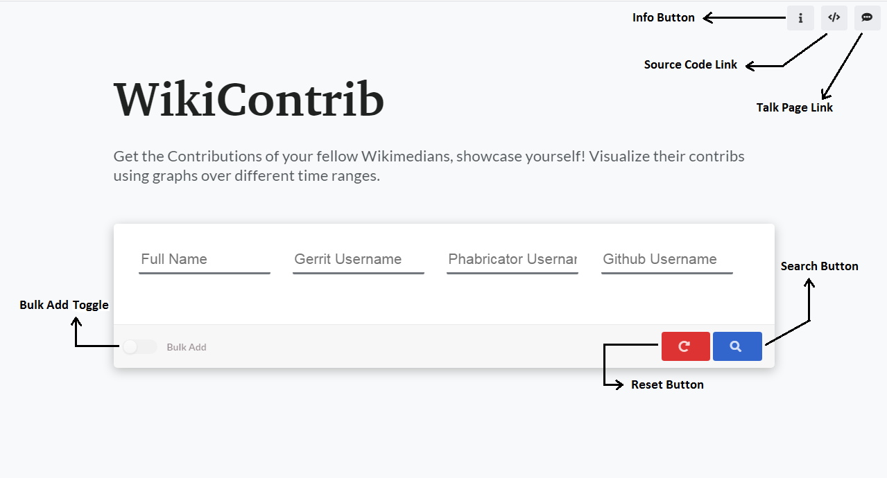
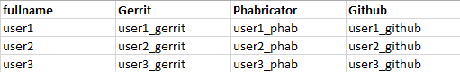
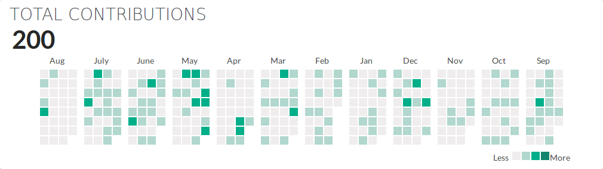

``Please note that all functionalities associated with the features allowing users to add multiple contributors details at once has been disabled. If these features are
important to you, you can reach out on `Github <https://github.com/wikimedia/wikicontrib>`_ or `WikiContrib talk page<https://meta.wikimedia.org/wiki/Talk:WikiContrib>`_``

=======
Usage
=======

As specified, WikiContrib is used in visualizing the contributions of Wikimedians in the form of graphs and user contribution calendar. Let’s start the discussion with how to use the tool first.

Intro to Queries
================

A Query is initiated whenever a user searches for the contributions of a single or a group of Wikimedians. Each query is uniquely identified by a user-friendly hash.
Each query has a **group of filters** associated with it. There are two filters in a query:

1. From time.
2. Time Range.

**From time:** The user can get all the commits from a specified time (i.e month and year).

**Time Range:** From the specified **From time**, the user needs to give a range
  of time to which he/she want to fetch the details with the maximum being one year
  (i.e last one year, last one month or last 6 months, etc).

Query Creation
==============

To create a query, the user needs to add the data (contributors full name, usernames of Gerrit, Phabricator, and Github) to the query. The user can add the data in two
different ways:

1. Entering usernames manually.
2. Adding usernames in bulk.

**Entering usernames manually:**

**Home page**

Whenever the user goes to the home page, the above page will be displayed.
In the above, the table has four columns. They are:

1. Fullname
2. Gerrit Username
3. Phabricator Username
4. Github Username

The user needs to fill the above four details of the corresponding Wikimedian whom the user wants to view the contributions of. ``Gerrit Username`` is used to fetch the data from **Gerrit APIs**,  same with ``Phabricator`` and ``Github`` usernames.
The details fetched from the APIs are associated with a common name i.e ``Fullname`` of the user.
Fullname is also used in searching the users, we will discuss the searching in the later part of the doc.

There is an option provided to add usernames of multiple Wikimedians.
By clicking on **Add Row** button, another empty row is added to the DOM. Similarly,
the user can add any number of rows and fill the usernames into them. One of the cool things about the tool is the usernames the user entered will be cached in the user device cache. So, even if the user refreshes or closes the page, the details will not be lost! the user can fill a few usernames at some time, close the page and re-open it at some other time and add few other usernames. The user can also clear the cached data. Clicking the **Reset** button clears all the data he/she entered into the tool.

**Adding Usernames in Bulk:**

Entering usernames of tens of users is easy. But what if the user wants to know the contributions of hundreds of **Wikimedians**? It will take a lot of time and work to fill them manually to the tool. So, there is also an option to upload all the usernames in a CSV file. On clicking the toggle bar with text “Bulk Add”,
the user will be provided with an option to upload a CSV file. If the user is uploading a CSV file, he/she needs to fill the data in the file in a particular format.

The CSV format is:

**Once the data is provided,** (either entered manually or using a CSV file),
The user can click the **search** button and this initiates a request to the server. The tool first verifies that the usernames provided belong to the same user and if not, warns the user of the mismatch. The user can decide whether to proceed or to crosscheck the provided usernames. If the usernames match or if the user decides to proceed, the tool then makes API requests to Gerrit, Phabricator, Github APIs.
Once all the required details are fetched, it redirects to a URL ``/<query_hash_code>``.
Now the user can see the graphs of user contributions vs time along with a calendar
that displays the contributions.

**Note:** ``query_hash_code`` is the hash-code generated by the query, the query
can be accessed at any point in time using the hash-code.

**User contribution calendar looks like:**

If the user clicks on a specific date in the above calendar, all the commits made
by the Wikimedian along with the ``platform`` will be displayed.

Hovering on the **info** button gives a popup with an intro paragraph about the tool.

Viewing / Updating filters
==========================

The user can view the results by following the above process of creating a query,
there are also few filters displayed along with the result. The filters can be updated.
Updating the current filters performs an API request and fetches the contributions of
the Wikimedian according to the filters the user provided.

There is also an option to reset the filters to the default ones. Filters are associated with the Query. The contributions of all the Wikimedians are fetched according to the filters the user changed!

**Note:** Presently, the user can see all the contributions of any Wikimedian for
the past one year (at maximum).

Viewing results
===============

Once the contributions of the user are fetched, these things are displayed:
 1. Graph of user contributions in **Gerrit**.
 2. Graph of user contributions in **Phabricator**.
 3. Graph of user contributions in *Github*.
 4. A simple calendar that displays all the user contributions for the period you provide (similar to **Github green squires**).

At a time, the contributions of a single user are displayed. There are arrows
provided to get the details of the next and previous user to the current user.
There is also an input box provided. If you want to get the contributions of a
specific user, you can search the ``fullname`` of the user in the search box.
It displays the recommendations of the top 50 matching users.

Updating Queries
===============

Once a user creates a query with the usernames of a set of Wikimedians and at a
later point of time, if he/she wants to know the contributions of another Wikimedian,
instead of creating a new query for a single Wikimedian, he/she can update the
query and add the corresponding usernames.

There are four main different types of updates possible:

1. Initially a **CSV file** can be provided, another **CSV file** can be provided while updating the query.
2. Initially a **CSV file** can be provided, a set of **usernames of Wikimedians** can be provided manually while updating the query.
3. Initially a **set of usernames** of Wikimedians are provided manually, a **CSV file** can be provided while updating the query.
4. Initially a **set of usernames** of Wikimedians are provided manually, another set of **usernames of Wikimedians** are provided manually while updating the query.
